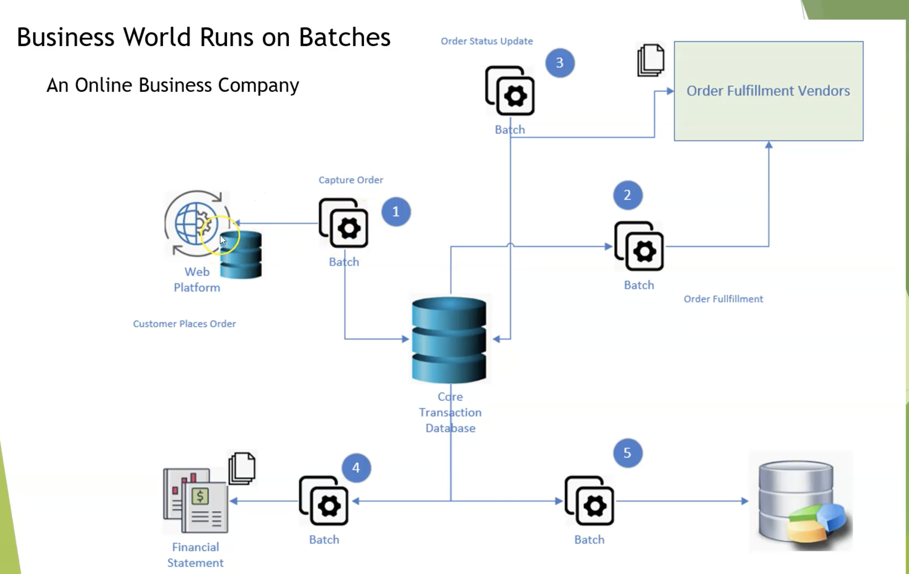

### 1. Introduction

# What is the Batch Processing?
It is defined as the processing of an amount of data without interaction or interruption.
The most common scenario for batch application is exporting data to file from one system and processing them in another.

Spring Boot Batch provides reusable functions that are essential in processing large volumes of records, including logging/tracing, transaction management, job processing statistics, job restart, skip, and resource management

### Explain Spring Batch framework.
Spring Batch is a lightweight, comprehensive batch framework designed to enable the development of robust batch applications vital for the daily operations of enterprise systems. Spring Batch builds upon the productivity, POJO-based development approach, and general ease of use capabilities people have come to know from the Spring Framework, while making it easy for developers to access and leverage more advanced enterprise services when necessary.

### Batch Processing
1.  ### Process large data Volume
    -   Able to handle large volumes of data to import, export or compute
2.  ### Automation
    -   Run without human interaction except for serious problem
3.  ### Robustness
    -   Handle invalid data without crashing or aborting prematurely
4.  ### Reliability 
    -   Keep track of what goes wrong and when

5.  ### Performance
    -   Must perform well to finish processing in a dedicated time window
    -   Avoid disturbing any other applications running simultaneously.

### When to use Spring Batch?
Consider an environment where users have to do a lot of batch processing. This will be quite different from a typical web application which has to work 24/7. But in classic environments it's not unusual to do the heavy lifting for example during the night when there are no regular users using your system. Batch processing includes typical tasks like reading and writing to files, transforming data, reading from or writing to databases, create reports, import and export data and things like that. Often these steps have to be chained together or you have to create more complex workflows where you have to define which job steps can be run in parallel or have to be run sequentially etc. That's where a framework like Spring Batch can be very handy. Spring Boot Batch provides reusable functions that are essential in processing large volumes of records, including logging/tracing, transaction management, job processing statistics, job restart, skip, and resource management. It also provides more advanced technical services and features that will enable extremely high-volume and high performance batch jobs though optimization and partitioning techniques.Simple as well as complex, high-volume batch jobs can leverage the framework in a highly scalable manner to process significant volumes of information.

### How Spring Batch works?

-   **step** - A Step that delegates to a Job to do its work. This is a great tool for managing dependencies between jobs, and also to modularise complex step logic into something that is testable in isolation. The job is executed with parameters that can be extracted from the step execution, hence this step can also be usefully used as the worker in a parallel or partitioned execution.
-   **ItemReader** - Strategy interface for providing the data. Implementations are expected to be stateful and will be called multiple times for each batch, with each call to read() returning a different value and finally returning null when all input data is exhausted. Implementations need not be thread-safe and clients of a ItemReader need to be aware that this is the case. A richer interface (e.g. with a look ahead or peek) is not feasible because we need to support transactions in an asynchronous batch.
-   **ItemProcessor** - Interface for item transformation. Given an item as input, this interface provides an extension point which allows for the application of business logic in an item oriented processing scenario. It should be noted that while it's possible to return a different type than the one provided, it's not strictly necessary. Furthermore, returning null indicates that the item should not be continued to be processed.
-   **ItemStreamWriter** - Basic interface for generic output operations. Class implementing this interface will be responsible for serializing objects as necessary. Generally, it is responsibility of implementing class to decide which technology to use for mapping and how it should be configured. The write method is responsible for making sure that any internal buffers are flushed. If a transaction is active it will also usually be necessary to discard the output on a subsequent rollback. The resource to which the writer is sending data should normally be able to handle this itself.

### Spring Batch
-   #### Based on Spring Framework Foundation
    -   Enterprise support
    -   Dependency injection
-   #### Batch-oriented processing
    -   Enforce the best practices when reading and writing the data
-   #### Ready to use component
    -   Out of boxes components allow you address common batch scenarios with minimum coding
-   #### Robustness and reliability
    -   Allows for declarative skipping and retry
    -   Enable restart after failure        
-   #### Lightweight and very easy to learn
-   #### POJO -based, it is testable!        
-   #### Usability , maintainability and extensibility
    -   Usability is about the code, easily extend an common component and add new features.
-   #### Scalability 

</img>

-------------
2. Hello Spring Batch
-   Create project
(Hello Project)[https://github.com/ckgauro/SpringBatch/tree/master/Master%20Spring%20Batch/Section%201%20Meet%20the%20Spring%20Batch/project/helloworld]

@EnableBatchProcessing 

tasklet
JobBuilderFactory
StepBuilderFactory

3. Review Hello World Batch

[Revise PPT]

4. Where is the sample code

